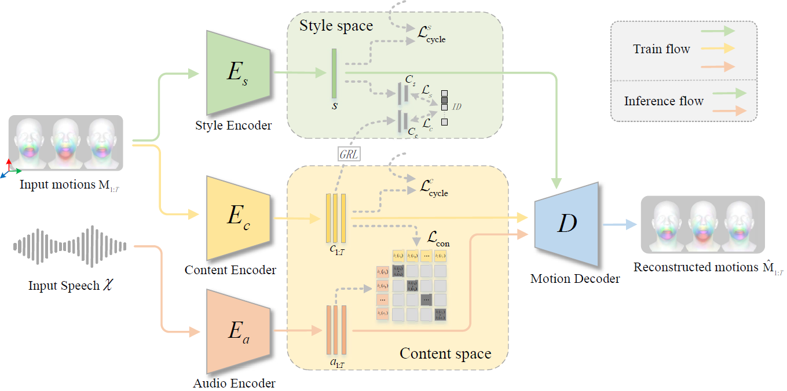
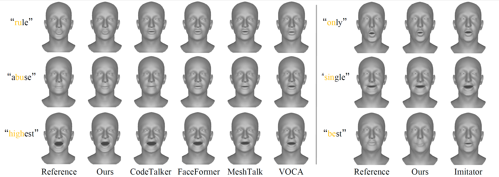

## **Mimic**

Official PyTorch implementation for the paper:

> **Mimic: Speaking Style Disentanglement for Speech-Driven 3D Facial Animation**, ***AAAI 2024***.
>
> Hui Fu, Zeqing Wang, Ke Gong, Keze Wang, Tianshui Chen, Haojie Li, Haifeng Zeng, Wenxiong Kang
>
> <a href='https://arxiv.org/pdf/2312.10877.pdf'></a> <a href='https://zeqing-wang.github.io/Mimic/'></a>

<p align="center">

</p>

>Speech-driven 3D facial animation aims to synthesize vivid facial animations that accurately synchronize with speech and match the unique speaking style. However, existing works primarily focus on achieving precise lip synchronization while neglecting to model the subject-specific speaking style, often resulting in unrealistic facial animations. To the best of our knowledge, this work makes the first attempt to explore the coupled information between the speaking style and the semantic content in facial motions. Specifically, we introduce an innovative speaking style disentanglement method, which enables arbitrary-subject speaking style encoding and leads to a more realistic synthesis of speech-driven facial animations. Subsequently, we propose a novel framework called **Mimic** to learn disentangled representations of the speaking style and content from facial motions by building two latent spaces for style and content, respectively. Moreover, to facilitate disentangled representation learning, we introduce four well-designed constraints: an auxiliary style classifier, an auxiliary inverse classifier, a content contrastive loss, and a pair of latent cycle losses, which can effectively contribute to the construction of the identity-related style space and semantic-related content space. Extensive qualitative and quantitative experiments conducted on three publicly available datasets demonstrate that our approach outperforms state-of-the-art methods and is capable of capturing diverse speaking styles for speech-driven 3D facial animation.

<p align="center">

</p>

## **TODO**
- Release codes and weights
- Release 3D-HDTF
<!-- 
## **Environment**
- Linux
- Python 3.9
- Pytorch 1.13.1
- CUDA 11.6 (GPU with at least 24GB VRAM) -->

<!-- Other necessary packages:
```
pip install -r requirements.txt
```
- ffmpeg
- [MPI-IS/mesh](https://github.com/MPI-IS/mesh)

## **Acknowledgement**
We heavily borrow the code from
[CodeTalker](https://github.com/Doubiiu/CodeTalker) and
[VOCA](https://github.com/TimoBolkart/voca). Thanks
for sharing their code. Our 3D-HDTF dataset is based on [HDTF](https://github.com/MRzzm/HDTF). Third-party packages are owned by their respective authors and must be used under their respective licenses. -->

## **Citation**

If you find the code useful for your work, please star this repo and consider citing:

```
@inproceedings{hui2024Mimic,
  title={Mimic: Speaking Style Disentanglement for Speech-Driven 3D Facial Animation},
  author={Hui Fu, Zeqing Wang, Ke Gong, Keze Wang, Tianshui Chen, Haojie Li, Haifeng Zeng, Wenxiong Kang},
  booktitle={The 38th Annual AAAI Conference on Artificial Intelligence (AAAI)},
  year={2024}
}
```